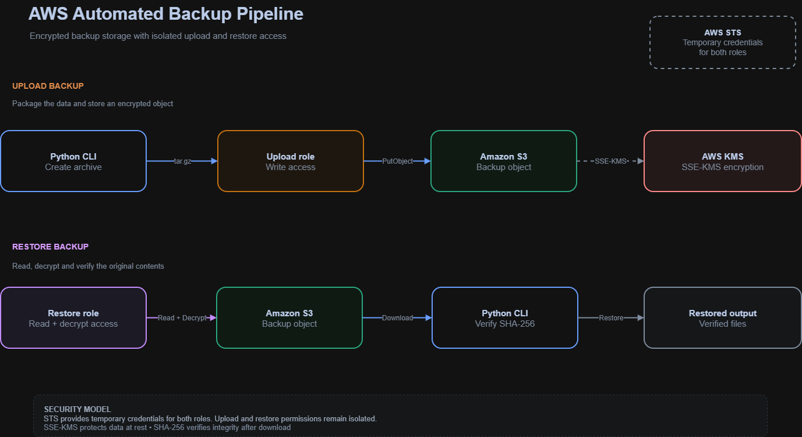

<div align="center">

# AWS Automated Backup Pipeline

**Secure, encrypted, and integrity-verified backup and restore workflow built with AWS, Python, and Terraform.**

[Architecture](#architecture) · [Features](#features) · [Deployment](#deployment) · [Testing](#testing)


</div>

> A Terraform-managed AWS backup workflow that packages local data, stores it in encrypted Amazon S3, and verifies integrity after restoration.

## Overview

This project implements a practical backup and restore workflow using Amazon S3, AWS KMS, IAM, STS temporary credentials, Python, and Terraform.

The pipeline creates a compressed archive from a local directory, uploads it to a private S3 bucket with SSE-KMS encryption, and restores it through a separate read and decrypt workflow. SHA-256 verification confirms that the restored data matches the original backup.

## Why this project

Reliable backups should be protected, recoverable, and verifiable.

This project demonstrates:

- Encrypted object storage with AWS KMS.
- Separate upload and restore permissions.
- Temporary credentials through AWS STS.
- Repeatable infrastructure with Terraform.
- Integrity verification during restore.
- Low operational overhead using managed AWS services.

## Architecture

The pipeline separates backup upload and restore access through dedicated IAM roles.



## Features

- Compressed `tar.gz` backup archives.
- Private Amazon S3 backup storage.
- SSE-KMS encryption at rest.
- Separate upload and restore IAM roles.
- Temporary AWS credentials through STS.
- S3 versioning and lifecycle configuration.
- S3 public-access blocking.
- SHA-256 integrity verification after restore.
- Terraform-managed infrastructure.
- Unit tests for backup and storage operations.

## Technology stack

| Component | Purpose |
|---|---|
| Python CLI | Creates archives and verifies restored data |
| Amazon S3 | Stores encrypted backup objects |
| AWS KMS | Provides encryption at rest |
| AWS IAM | Separates upload and restore permissions |
| AWS STS | Provides temporary credentials |
| Terraform | Provisions the AWS infrastructure |
| SHA-256 | Verifies backup integrity |

## Security

- S3 public access is blocked.
- Backup objects are encrypted with SSE-KMS.
- Upload and restore permissions are isolated.
- Temporary STS credentials are preferred over long-lived keys.
- AWS credentials must never be stored in source files.
- Terraform variables and state files must remain outside version control.
- A restore is successful only after SHA-256 verification passes.

## Requirements

- Python 3.11+
- Terraform 1.5+
- AWS CLI
- An AWS account for deployment or integration testing

## Installation

```bash
git clone [https://github.com/tatan461/aws-automated-backup-pipeline.git](https://github.com/tatan461/aws-automated-backup-pipeline.git)
cd aws-automated-backup-pipeline

python -m venv .venv
source .venv/bin/activate

pip install --upgrade pip
pip install -r requirements.txt
pip install -e .
```

On Windows PowerShell:

```powershell
.venv\Scripts\Activate.ps1
```

## Deployment

Terraform configuration is located in `infra/backup/`.

Create the local variables file:

```bash
cd infra/backup
cp terraform.tfvars.example terraform.tfvars
```

Initialize, validate, plan, and deploy:

```bash
terraform init
terraform fmt -check
terraform validate
terraform plan -var-file="terraform.tfvars"
terraform apply -var-file="terraform.tfvars"
```

Review the plan before applying it.

Never commit:

```text
terraform.tfvars
*.tfstate
*.tfstate.*
.env
AWS credentials
```

## Usage

Inspect the available command options:

```bash
python -m src.backup --help
python -m src.s3_storage --help
```

The operational workflow is:

1. Create a compressed backup archive.
2. Upload the archive using the upload role.
3. Store the object key and expected SHA-256 digest.
4. Restore the backup using the restore role.
5. Extract the archive.
6. Verify the SHA-256 digest.

See the [restore runbook](docs/restore-runbook.md) for the recovery procedure.

## Testing

Run the unit tests:

```bash
python -m pytest -q
```

Optional quality checks:

```bash
ruff check .
bandit -r src
```

Validate Terraform:

```bash
cd infra/backup
terraform fmt -check
terraform validate
```

## Project structure

```text
.
├── docs/
│   ├── architecture.md
│   ├── architecture.png
│   ├── cost-model.md
│   └── restore-runbook.md
├── examples/
├── infra/
│   └── backup/
│       ├── main.tf
│       ├── terraform.tfvars.example
│       └── .terraform.lock.hcl
├── src/
│   ├── backup.py
│   └── s3_storage.py
├── tests/
│   ├── test_backup.py
│   └── test_s3_storage.py
├── LICENSE
├── pyproject.toml
├── requirements.txt
└── README.md
```

## Documentation

- [Architecture notes](docs/architecture.md)
- [Restore runbook](docs/restore-runbook.md)
- [Cost model](docs/cost-model.md)

## Author

**Jonathan Angel Gonzalez**  
Junior Cloud Engineer · AWS Certified Specialist

[](https://github.com/tatan461)
[](https://www.linkedin.com/in/jonathan-angel-gonzalez-0543b441a/)

## License

This project is licensed under the [MIT License](LICENSE).